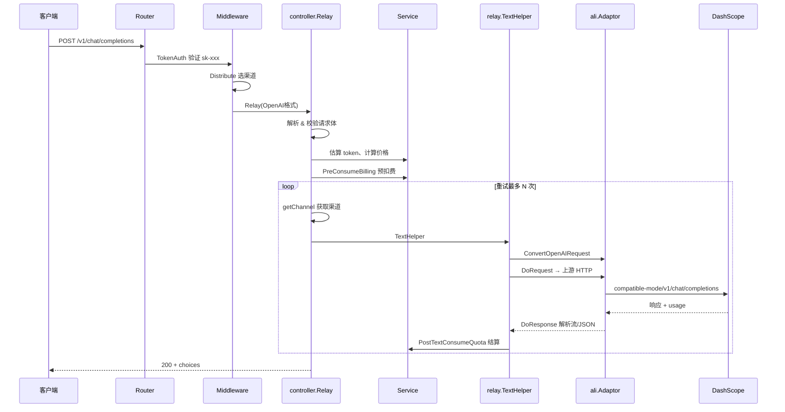

# New API 项目说明

| 项 | 说明 |
|---|---|
| **文档标题** | New API 项目设计思路与工作流程 |
| **作者** | 陈云杰 |
| **编写日期** | 2026-06-24 |
| **文档版本** | 1.1.0 |
| **适用代码版本** | New API `v0.0.0`（`common/constants.go`，构建时自动注入） |
| **代码快照** | Git commit `055c59fa9` |

> 本文档描述 New API 的整体定位、架构设计与一次典型 AI 请求的完整工作流程，便于本地开发、联调与二次开发时快速建立全局认识。

---

## 一、项目定位

**New API** 是一个 **AI API 网关 / 代理**，核心作用是：

- 对外提供 **统一 API 入口**（兼容 OpenAI、Claude、Gemini 等协议）
- 对内聚合 **40+ 上游渠道**（OpenAI、阿里云 DashScope、Azure、AWS Bedrock、DeepSeek 等）
- 提供 **用户管理、令牌鉴权、渠道调度、计费扣费、限流、管理后台** 等能力

可以把它理解成：在客户端和真实模型服务之间加一层「调度 + 管控 + 计费」的中间层。

```
客户端 (Cursor / Python / 业务系统)
        │  Authorization: Bearer sk-xxx
        ▼
   New API (例: localhost:3000)
        │  选渠道、换 Key、计费、限流
        ▼
   上游渠道 (DashScope / OpenAI / ...)
```

---

## 二、设计思路

### 1. 统一入口，多协议兼容

客户端通常只需对接 OpenAI 风格 API（如 `/v1/chat/completions`），网关负责：

- 解析请求 → 选择渠道 → **格式转换** → 转发上游 → **响应转换** → 返回客户端

同时支持 Claude（`/v1/messages`）、Gemini（`/v1beta/models/...`）、Responses API、Embedding、Image、Audio 等。

### 2. 分层架构，职责清晰

```
Router      → 路由注册、中间件链
Controller  → HTTP 入口、编排流程
Service     → 业务逻辑（计费、敏感词、渠道亲和性等）
Model       → 数据库访问（GORM）
Relay       → AI 请求转发核心
  └── channel/  → 各上游适配器（Adaptor 模式）
```

**Adaptor 模式**是 relay 层的核心：每个上游渠道实现同一套接口（转换请求、发 HTTP、解析响应），新增渠道只需增加 `relay/channel/xxx/` 包并在 `relay/relay_adaptor.go` 注册。

### 3. 渠道与令牌分离

| 概念 | 作用 |
|------|------|
| **Token (`sk-...`)** | 客户端使用的网关密钥，绑定用户、额度、可用模型 |
| **Channel** | 上游真实 API Key + Base URL + 支持的模型列表 |
| **Group** | 用户分组，决定能走哪些渠道、倍率多少 |

客户端只持有 `sk-xxx`，**不应直接接触**上游 DashScope / OpenAI 的真实 Key。

### 4. 预扣费 + 后结算

1. 请求前按 token 估算 **预扣费**
2. 上游返回后按实际 usage **补扣或退还**
3. 请求失败则 **退款**

相关代码：`service/billing.go`、`service/text_quota.go`。

### 5. 可配置、可扩展

- **渠道级**：模型映射、参数覆盖、系统提示词、请求体透传
- **全局级**：倍率、模型定价、限流、Chat → Responses 兼容策略
- **动态计费**：表达式定价（见 `pkg/billingexpr/expr.md`）

---

## 三、技术栈

| 层 | 技术 |
|----|------|
| 后端 | Go 1.22+、Gin、GORM v2 |
| 数据库 | SQLite / MySQL / PostgreSQL（三库兼容） |
| 缓存 | Redis + 内存缓存 |
| 前端 | React 19、Rsbuild、Tailwind（`web/default/`） |
| 鉴权 | JWT、WebAuthn、OAuth |

---

## 四、目录结构（核心）

```
new-api/
├── main.go                 # 启动入口，嵌入前端静态资源
├── router/                 # 路由：/api、/v1、/dashboard、Web
├── controller/             # 控制器：Relay、用户、渠道、日志等
├── middleware/             # 鉴权、限流、渠道分发 Distribute
├── service/                # 计费、敏感词、OAuth 等业务
├── model/                  # User、Token、Channel、Log 等 DB 模型
├── dto/                    # 请求/响应结构体（GeneralOpenAIRequest 等）
├── relay/                  # 转发核心
│   ├── compatible_handler.go   # Chat/Completion 主流程
│   ├── relay_adaptor.go        # 按渠道类型选 Adaptor
│   └── channel/                # 各上游适配器
│       ├── openai/
│       ├── ali/                # 阿里云 DashScope
│       ├── claude/
│       └── ...
├── setting/                # 运行时配置（倍率、模型、性能等）
├── common/                 # JSON、Redis、环境变量等工具
└── web/default/            # 管理后台前端
```

---

## 五、一次 Chat 请求的完整流程

以 `POST /v1/chat/completions` + 模型 `qwen3.6-27b` 为例：



### 步骤拆解

#### ① 路由与中间件（`router/relay-router.go`）

```
POST /v1/chat/completions
  → TokenAuth()              # 校验 sk-xxx，加载用户/令牌信息
  → ModelRequestRateLimit()
  → Distribute()             # 根据 model 字段选择渠道
  → controller.Relay()
```

#### ② 控制器编排（`controller/relay.go`）

1. `GetAndValidateRequest` — 解析 JSON 到 `dto.GeneralOpenAIRequest`
2. `GenRelayInfo` — 组装转发上下文（模型名、是否流式、渠道信息等）
3. 敏感词检查（可选）
4. `EstimateRequestToken` + `ModelPriceHelper` — 算价
5. `PreConsumeBilling` — 预扣额度
6. **重试循环**：选渠道 → 调用 relay → 失败则换渠道重试
7. 失败时 `Billing.Refund()` 退款

#### ③ Relay 转发（`relay/compatible_handler.go`）

1. 模型名映射（`ModelMappedHelper`）
2. 获取对应 **Adaptor**（阿里渠道 → `ali.Adaptor`）
3. `ConvertOpenAIRequest` — 请求转换
4. `RemoveDisabledFields` — 过滤敏感字段（如 `service_tier`）
5. `ApplyParamOverride` — 渠道参数覆盖
6. `DoRequest` — 发 HTTP 到上游
7. `DoResponse` — 解析响应（含 SSE 流）
8. `PostTextConsumeQuota` — 按 usage 结算

#### ④ 阿里 / Qwen 渠道（`relay/channel/ali/`）

- URL：`{BaseURL}/compatible-mode/v1/chat/completions`
- Header：`Authorization: Bearer {渠道Key}`；流式时加 `X-DashScope-SSE: enable`
- Base URL 应为 `https://dashscope.aliyuncs.com`（**不要**再拼 `/compatible-mode`，否则会路径重复导致 404）
- Qwen 扩展参数（如 `chat_template_kwargs`、`enable_thinking`）定义在 `dto/openai_request.go`，默认会透传到上游

---

## 六、核心数据模型

```
User（用户）
  ├── Quota（钱包额度）
  ├── Group（分组，如 default / vip）
  └── Token[]（API 密钥 sk-xxx）
        ├── 可用模型限制
        ├── 过期时间 / 额度上限
        └── 绑定特定渠道（可选）

Channel（渠道）
  ├── Type（如 17 = 阿里）
  ├── Key（上游 API Key）
  ├── BaseURL
  ├── Models（支持的模型列表）
  ├── Group（所属分组）
  ├── Weight / Priority（调度权重）
  ├── ModelMapping（模型名映射）
  └── Setting（系统提示词、透传开关等）

Log（消费日志）
  ├── token_name（令牌名称，见下文「数据看板 Tokens 消耗」）
  └── prompt_tokens、completion_tokens、quota、channel_id ...
```

**调度逻辑**（`middleware/distributor.go`）：

1. 从请求体读取 `model`
2. 按用户 Group + 模型名，在可用 Channel 中按权重 / 优先级 / 亲和性选择
3. 写入 Context，供后续 relay 使用

---

## 七、两类 API 路径与地址填写说明

### 1. 路径分类

| 路径前缀 | 用途 | 调用方 |
|---------|------|--------|
| `/v1/*` | **Relay API**，OpenAI 兼容，模型推理 | 客户端、SDK、测试脚本 |
| `/api/*` | **管理 API**，用户 / 渠道 / 日志 / 配置 | 管理后台前端 |
| `/` | **Web UI**，嵌入的 React 管理界面 | 浏览器 |

### 2. 客户端应填写的 API 地址（调用模型）

客户端（Python、Cursor、OpenAI SDK 等）对接的是 **本服务对外暴露的 Relay 根地址**，不是上游 DashScope / OpenAI 的地址。

| 场景 | Base URL（OpenAI SDK 的 `base_url`） | 完整 Chat 端点 |
|------|--------------------------------------|----------------|
| 本地后端 | `http://127.0.0.1:3000/v1` | `http://127.0.0.1:3000/v1/chat/completions` |
| 生产部署 | `https://你的域名/v1` | `https://你的域名/v1/chat/completions` |

**鉴权：** `Authorization: Bearer sk-xxx`（在管理后台「令牌」页创建，`sk-` 前缀由系统生成）。

**常见填法示例：**

```python
# OpenAI Python SDK
client = OpenAI(
    api_key="sk-xxx",                        # 本项目的令牌，不是上游 Key
    base_url="http://127.0.0.1:3000/v1",     # 本项目地址 + /v1
)
```

```bash
# curl
curl http://127.0.0.1:3000/v1/chat/completions \
  -H "Authorization: Bearer sk-xxx" \
  -H "Content-Type: application/json" \
  -d '{"model":"qwen3.6-27b","messages":[{"role":"user","content":"hi"}]}'
```

> **开发注意：** 前端 dev 服务器（`:5173`）通常只代理 `/api`，**不代理 `/v1`**。模型调用必须直连后端（`:3000`），或通过生产环境同一域名访问。

### 3. 系统设置中的「服务器地址」（ServerAddress）

路径：**系统设置 → 系统信息 → 服务器地址**

| 项 | 说明 |
|----|------|
| **填什么** | 站点对外的完整 URL，如 `https://api.example.com`（不要末尾 `/`） |
| **用途** | OAuth 回调、支付/Webhook、CC Switch 导入、定价页代码示例等 |
| **未填写时** | 前端回退为当前浏览器 `window.location.origin`（本地即 `http://localhost:3000`） |

**与客户端 Base URL 的关系：**

- `ServerAddress` = 站点根，如 `https://api.example.com`
- 客户端 Base URL = `{ServerAddress}/v1`
- 管理 API = `{ServerAddress}/api/...`

### 4. 渠道 Base URL（易混淆，勿填错）

| 配置位置 | 填什么 | 示例 |
|---------|--------|------|
| **渠道 → Base URL** | 上游厂商 API 根地址 | `https://dashscope.aliyuncs.com` |
| **客户端 / SDK** | **本项目** Relay 地址 | `http://127.0.0.1:3000/v1` |

渠道 Base URL 仅用于网关转发到上游，**不会**发给业务客户端。

---

## 八、数据看板「Tokens 消耗」中的令牌名称

「Tokens 消耗」图表按 **`logs.token_name`** 聚合（见 `model/usedata_token.go`）。名称来源如下：

| 来源 | `token_name` 取值 | 说明 |
|------|-------------------|------|
| 正常 API 调用 | 令牌管理里创建的 **名称** | 请求经 `middleware/auth.go` 写入 Context，计费日志记录 `token.Name` |
| 渠道测试 | 固定 **`模型测试`** | 管理后台「渠道 → 测试」时，`controller/channel-test.go` 写死该名称 |

**本地库示例：** 若看到 `test` 与 `模型测试` 两条曲线——`test` 来自名为 `test` 的用户令牌；`模型测试` 来自某次渠道连通性测试产生的 1 条消费日志（模型 `qwen3.6-27b`）。可在 **使用日志** 页按 `token_name` 筛选核实。

---

## 九、Adaptor 接口（扩展渠道的关键）

每个渠道实现 `relay/channel/adapter.go` 中的 `Adaptor` 接口：

```go
Init(info)
GetRequestURL(info)           // 拼上游 URL
SetupRequestHeader(...)       // 设置鉴权头等
ConvertOpenAIRequest(...)     // OpenAI 格式 → 上游格式
DoRequest(...)                // 发 HTTP
DoResponse(...)               // 解析响应，返回 usage
```

新增渠道步骤：新建 `relay/channel/xxx/` → 实现接口 → 在 `GetAdaptor` 注册。

---

## 十、计费流程

```
请求到达
  → 估算 prompt tokens × 模型倍率/价格
  → PreConsumeBilling（预扣）
  → 转发上游
  → 拿到 usage（prompt + completion tokens）
  → PostTextConsumeQuota（实际扣费，多退少补）
  → 写 Log + 更新 User/Channel 用量
```

支持：按 token 倍率、按次定价、表达式动态计费、订阅额度等。

---

## 十一、前端与管理后台

- 源码：`web/default/`（React 19 + Rsbuild + i18n）
- 生产构建后由 Go `embed` 进二进制，访问 `http://localhost:3000` 即可
- 功能：渠道配置、令牌管理、用户/分组、日志、倍率、模型列表、Playground（`/pg/chat/completions`）

---

## 十二、本地开发典型配置示例

```
用户 Token: sk-xxx              → New API 鉴权
渠道 #1: 阿里 DashScope          → 上游真实 Key
模型: qwen3.6-27b               → 写在渠道 Models 中
Base URL: https://dashscope.aliyuncs.com

test/large_context_demo.py      → 直连 :3000/v1/chat/completions
web dev :5173                   → 管理界面，不转发 /v1
```

---

## 十三、设计亮点小结

| 设计点 | 价值 |
|--------|------|
| Adaptor 插件化 | 新增上游成本低 |
| Token / Channel 分离 | 安全分发、统一计费 |
| 预扣 + 后结算 | 防止超支 |
| 渠道重试 + 权重调度 | 高可用 |
| 多协议统一入口 | 客户端零改造切换模型 |
| 三库兼容 + 配置热更新 | 部署灵活 |

---

## 十四、延伸阅读

| 主题 | 路径 |
|------|------|
| Relay OpenAPI | `docs/openapi/relay.json` |
| 管理 API OpenAPI | `docs/openapi/api.json` |
| 渠道其他设置 | `docs/channel/other_setting.md` |
| 翻译术语表 | `docs/translation-glossary.md` |
| 动态计费表达式 | `pkg/billingexpr/expr.md` |
| 项目约定（Agent） | `AGENTS.md` / `CLAUDE.md` |

---

## 修订记录

| 版本 | 日期 | 作者 | 说明 |
|------|------|------|------|
| 1.0.0 | 2026-06-24 | 陈云杰 | 初版：项目定位、架构、Chat 请求全流程 |
| 1.1.0 | 2026-06-24 | 陈云杰 | 补充 API 地址填写说明、Tokens 消耗 token_name 来源 |
