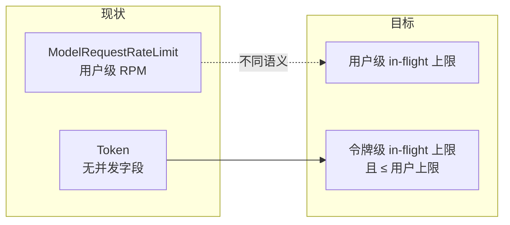
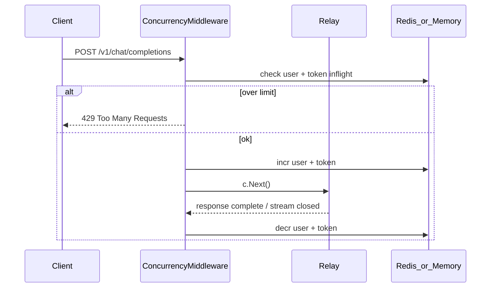

# 令牌级 In-Flight 并发控制 — 需求评估与方案设计

> 状态：需求已确认，**尚未实现**（方案归档）

## 一、需求澄清（已确认）

你要的是 **左项：同时进行中请求数（in-flight）**，不是现有系统里的 RPM 频率限制。

| 维度 | 你的目标 |
|------|----------|
| 控制对象 | 每个 API 令牌（≈ 一个下游应用场景） |
| 控制指标 | 同一时刻未结束的 Relay 请求数（含流式，从进入到响应/连接关闭） |
| 层级关系 | **令牌并发上限 ≤ 用户并发上限** |
| 业务动机 | 隔离「设计不合理」的应用，避免单应用占满连接/模型承压 |

---

## 二、现有能力与差距

### 当前实现（不是 in-flight）

[`middleware/model-rate-limit.go`](../../middleware/model-rate-limit.go) 的 `ModelRequestRateLimit`：

- 按 **`userId`** 计数
- 指标是 **时间窗口内请求次数**（成功次数 + 可选总次数令牌桶）
- 配置在 [`setting/rate_limit.go`](../../setting/rate_limit.go) + 管理后台「请求限制」

[`model/token.go`](../../model/token.go) 的 `Token` 结构：**无**并发/频率字段，仅有额度、模型限制、IP、分组等。

### 差距总结



**结论：** 需求合理，但属于 **新能力**，不能靠现有 RPM 中间件扩展语义实现，需要独立的 in-flight 并发层。

---

## 三、需求合理性评估

### 合理之处

1. **与「一令牌一应用」模型匹配**  
   令牌已是鉴权、计费、日志 (`token_name`) 的最小单元；在令牌上设 in-flight 上限，能精确隔离下游应用。

2. **比 RPM 更贴合「模型承压」**  
   10 个长流式请求占 10 条连接；RPM 只限制「发起次数」，无法限制「同时进行中的长任务」。in-flight 直接限制占用。

3. **用户级 + 令牌级双层符合资源归属**  
   - 用户级：账号总预算（所有令牌之和的上界）  
   - 令牌级：单应用配额  
   - 约束「令牌 ≤ 用户」避免配置自相矛盾。

4. **与现有分层一致**  
   类似「用户额度 / 令牌额度」：用户是容器，令牌是子配额。

### 需要明确的边界（设计时必须写清）

| 问题 | 建议默认 |
|------|----------|
| 用户级 in-flight 是否已有？ | **没有**，需新增；不要与 `ModelRequestRateLimit` 混为一谈 |
| 多令牌之和能否超过用户上限？ | **可以**。用户上限约束「同时进行中总数」；各令牌上限约束「单应用」；例：用户=10，令牌 A=5、B=5，A 满时 B 仍可用 |
| 单令牌上限 vs 用户上限 | **每个** `token.max_concurrent ≤ user.max_concurrent`（保存时校验） |
| 0 / 空值语义 | `0` 或「未设置」= **不限制**（与现有 rate limit 的 0 语义一致） |
| Playground `/pg/*` | 走 `UserAuth`，无令牌；**仅应用用户级** in-flight（或暂不参与） |
| 非 Relay 路由 | `/api/*` 管理接口不计入模型 in-flight |

**总体结论：需求合理，建议做。** 优先实现 in-flight；RPM 保留为可选补充，不互相替代。

---

## 四、方案设计（确认需求后再实现）

### 4.1 数据模型

**用户级**（二选一，推荐 A）：

- **A（推荐）** [`dto/user_settings.go`](../../dto/user_settings.go) 增加 `max_concurrent *int`  
  - 存于 `users.setting` JSON，可按用户差异化  
- **B** 系统/分组级默认值 + 用户继承（类似 `ModelRequestRateLimitGroup`）

**令牌级** — [`model/token.go`](../../model/token.go) 增加：

```go
MaxConcurrent int `json:"max_concurrent" gorm:"default:0"` // 0 = unlimited
```

**校验规则（保存令牌 / 保存用户设置时）：**

- `token.max_concurrent == 0` → 跳过  
- `token.max_concurrent > 0` 且 `user.max_concurrent > 0` → 必须 `token.max_concurrent <= user.max_concurrent`  
- 若用户未设上限而令牌设了上限 → **允许**（仅令牌级生效；用户级视为 unlimited）

### 4.2 运行时计数（核心）

**计数维度：**

- `user:{userId}:inflight` — 用户当前 in-flight 数  
- `token:{tokenId}:inflight` — 令牌当前 in-flight 数  

**生命周期：**



**挂载点：** [`router/relay-router.go`](../../router/relay-router.go) 中 `TokenAuth()` 之后、`ModelRequestRateLimit()` 附近新增 `TokenConcurrencyLimit()`，覆盖 `/v1/*`、`/v1beta/*` 等模型 Relay 路由。

**流式请求：** 必须在 **整个 SSE/WebSocket 连接结束** 时 decr，不能只在 `c.Next()` 返回后（Handler 返回时流可能仍在写）。需与 [`relay/helper/stream_scanner.go`](../../relay/helper/stream_scanner.go) 或 Relay 完成回调对齐，或在 middleware 用 `c.Writer` 包装 / `defer` + 监听 `CloseNotify`。

**异常断开：** Redis 场景建议：

- 使用带 **TTL 的 lease key**（请求 ID + 过期自动释放），或  
- 定期 reconcile，防止进程崩溃导致计数泄漏  

单机内存模式仅适用于单实例部署（与现有 `memoryRateLimitHandler` 一致）。

### 4.3 检查顺序与 HTTP 响应

1. 读取 `userId`、`tokenId`（已有 [`middleware/auth.go`](../../middleware/auth.go) `SetupContextForToken`）  
2. 若 `token.max_concurrent > 0` 且 `token inflight >= limit` → **429**，提示令牌并发已满  
3. 若 `user.max_concurrent > 0` 且 `user inflight >= limit` → **429**，提示用户并发已满  
4. 通过后 `incr`，`defer decr`（或 stream 结束回调 decr）

错误码与文案：复用 OpenAI 风格 429 + i18n key（参考 [`i18n/keys.go`](../../i18n/keys.go) `MsgRateLimitReached` 模式）。

### 4.4 管理后台

- **令牌编辑** [`web/default/src/features/keys/`](../../web/default/src/features/keys/)：新增「最大并发数」字段，保存时展示校验错误（超过用户上限）  
- **用户设置 / 管理员编辑用户**：新增「最大并发数」（UserSetting）  
- **可选**：系统设置页增加全局默认说明（非必须，第一期可只做用户+令牌）

### 4.5 与现有 RPM 的关系

| 机制 | 作用 | 关系 |
|------|------|------|
| `ModelRequestRateLimit` | 窗口内请求次数 | **保留**，先 RPM 再 in-flight 或反之均可；建议 **in-flight 在前**（更快失败，不占下游） |
| 新 `ConcurrencyLimit` | 同时进行中数 | **新增**，独立中间件与 Redis key 前缀 |

两者可同时启用，互不替代。

### 4.6 实现分期建议

**Phase 1（MVP）**

- 用户 + 令牌 in-flight 字段与校验  
- Redis + 内存双实现（对齐现有 rate limit 模式）  
- 覆盖 `/v1/chat/completions` 等主 Relay 路径  
- 非流式 + 流式正确 decr  

**Phase 2**

- WebSocket `/v1/realtime`、异步 Task 类 API  
- 管理后台监控：当前 in-flight / 历史拒绝次数  
- 分组级默认用户并发上限  

---

## 五、风险与注意

- **多实例必须 Redis**：内存计数无法跨 Pod 共享  
- **流式 decr 时机**是最大技术风险点，实现前需列出所有 Relay 出口（stream / non-stream / websocket）  
- **计数泄漏**会导致误杀；必须有 TTL 或 watchdog  
- **不要**把 RPM 配置 UI 改名为「并发」，避免用户混淆  

---

## 六、建议的下一步

1. 确认：**用户级 in-flight 也一并新建**（推荐），还是仅先做令牌级、用户级暂用全局默认？  
2. 确认后进入实现：先后端 middleware + 模型字段，再前端令牌/用户表单，最后流式 decr 联调。
